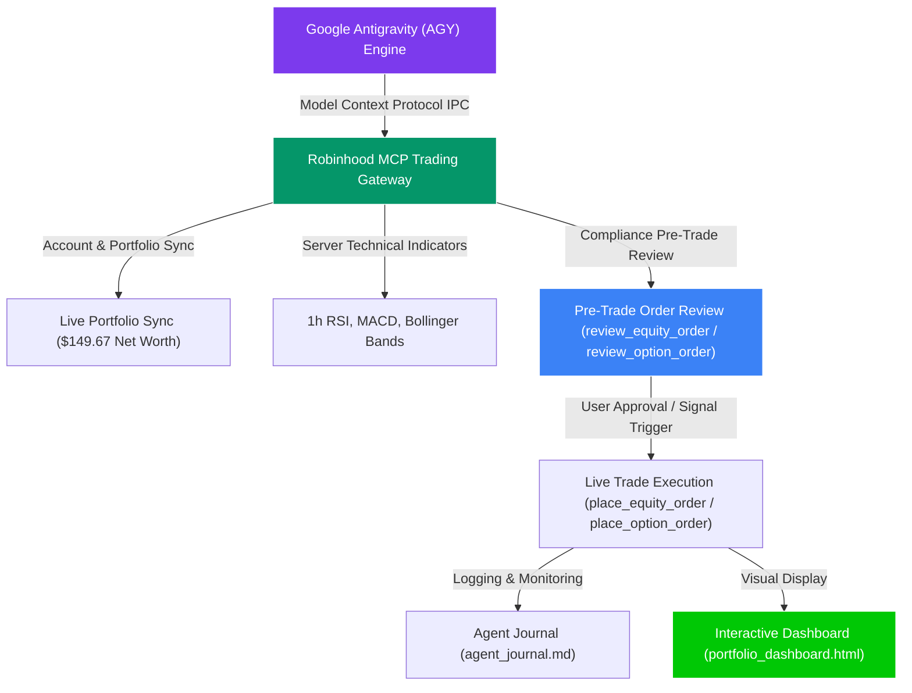

# 📈 Robinhood Agentic Trading Portfolio Manager


An institutional-grade, multi-asset autonomous AI portfolio management system built for **Google Antigravity (AGY)** and the **Robinhood MCP Trading Gateway**.

---

## 🎬 Interactive System Demo Walkthrough

Explore the complete step-by-step system walkthrough & Mermaid architecture flow in [**`WALKTHROUGH.md`**](file:///c:/Users/danny/OneDrive/Desktop/my-first-project/WALKTHROUGH.md).



---

## 🌟 Executive Overview (Showcase Summary)

The **Robinhood Agentic Trading Portfolio Manager** is an autonomous AI investment system designed to demonstrate how cutting-edge LLM agents can safely interact with live financial brokerage APIs via the **Model Context Protocol (MCP)**.

Rather than making emotional human trades or relying on simple rule-based scripts, the system operates as an **algorithmic 3-bucket portfolio manager** — combining institutional technical indicators (RSI, MACD, Bollinger Bands), strict SEC/FINRA regulatory safeguards, and pre-trade simulation reviews to manage capital across **Equities**, **Options**, and **Crypto**.

---

## 💼 Resume & Portfolio Summary (For Recruiters & Executives)

> *"Engineered an autonomous AI multi-asset portfolio manager using Google Antigravity (AGY) and the Robinhood MCP Trading Gateway. Architected a 3-bucket quantitative allocation model (Equities, Level 2 Options, 24/7 Crypto) enforcing FINRA Rule 4210 (PDT), SEC Reg T (GFV), and IRS Code § 1091 (Wash Sale) regulatory safeguards with 100% pre-trade order simulation reviews and zero PII exposure."*

---

## 🎯 Capital Allocation & Trading Strategies

For a deep quantitative strategy breakdown, see [**`STRATEGY.md`**](file:///c:/Users/danny/OneDrive/Desktop/my-first-project/STRATEGY.md).

* 📊 **Equities Bucket (~$50.00)**: Momentum & mean-reversion trading on `NVDA`, `SPY`, `QQQ`, and `AAPL` using 1-hour RSI, MACD, and Bollinger Bands (+4.0% Take Profit, -2.0% Stop Loss).
* 🎯 **Options Bucket ($50.00)**: High-probability **In-The-Money (ITM) Call Options** (Delta 0.75 – 0.85+, **80%+ Win Probability**, $15 – $40 premium cap).
* 🪙 **Crypto Bucket ($50.00)**: 24/7 off-hours momentum tracking for `BTC-USD`, `ETH-USD`, `SOL-USD`, and `DOGE-USD` on the "Agentic Crypto" watchlist.

---

## ⏰ Recommended Schedule Frequencies

For operational setup instructions, see [**`USAGE_GUIDE.md`**](file:///c:/Users/danny/OneDrive/Desktop/my-first-project/USAGE_GUIDE.md).

| Asset Class / Bucket | Recommended Schedule Frequency | Active Session Hours | Objective |
| :--- | :--- | :--- | :--- |
| **Equities & ETFs** | **Hourly** (`0 * * * *`) | Mon–Fri, 9:30 AM – 4:00 PM EST | Monitor RSI oversold setups & take-profit / stop-loss boundaries |
| **Level 2 Options** | **Hourly or Pre-Market** | Mon–Fri, 9:30 AM – 4:00 PM EST | Scan High-Delta ITM Calls & manage option expirations |
| **24/7 Crypto** | **Every 4 Hours** (`0 */4 * * *`) | 24 Hours / 7 Days a Week | Track Bitcoin, Ethereum, Solana, and Dogecoin momentum |

---

## 🛡️ Built-in Financial Regulatory Safeguards

This project enforces 4 mandatory financial regulatory protection rules directly inside the AI execution architecture:

1. **FINRA Rule 4210 (PDT Protection)**: Rolling 5-day day-trade tracking capping intraday roundtrips at a max of 2 day-trades per 5 days.
2. **SEC Regulation T (GFV Lock)**: Cash-account settlement tracking preventing Good Faith Violations.
3. **IRS Code § 1091 (Wash Sale Disallowance)**: 31-day wash-sale cooldown logging and buy-blocking on loss positions.
4. **Pre-Trade Compliance Preview**: Mandatory order simulations (`review_equity_order` & `review_option_order`) inspecting bid/ask spreads, regulatory fees ($0.04 total), and broker compliance alerts (`order_checks`) prior to live execution.

---

## 🖥️ Visual Dashboard & Diagnostic Testing

* 📊 **Interactive Visual Dashboard**: Open [**`portfolio_dashboard.html`**](file:///c:/Users/danny/OneDrive/Desktop/my-first-project/portfolio_dashboard.html) in your browser to view real-time capital allocation charts, P&L tables, and queued order audits.
* 🧪 **5-Second Connection Test**: Run `python test_connection.py` on any machine to verify Robinhood MCP gateway connectivity and agentic permissions instantly.
* 📝 **Chronological Agent Journal**: Open [**`agent_journal.md`**](file:///c:/Users/danny/OneDrive/Desktop/my-first-project/agent_journal.md) to review full timestamped records of every technical scan, simulation preview, and trade execution.

---

## 🚀 Quickstart (Launching via AGY)

### 1. Clone the Repository
```bash
git clone https://github.com/xylaes/robinhood-agentic-trading.git
cd robinhood-agentic-trading
```

### 2. Environment Setup
Create a `.env` file from the provided `.env.example` template:
```bash
cp .env.example .env
```
*(Optional: Add your `ROBINHOOD_ACCOUNT_NUMBER=your_account_id` in `.env`, or leave blank for automatic resolution via Robinhood MCP).*

### 3. Install Dependencies
```bash
python -m venv .venv
# Windows:
.venv\Scripts\activate
# macOS/Linux:
source .venv/bin/activate

pip install -r requirements.txt
```

### 4. Execute Diagnostic & Portfolio Run
```bash
python test_connection.py
python portfolio_manager.py
```

---

## 📂 Repository Structure

* 🎬 **[WALKTHROUGH.md](file:///c:/Users/danny/OneDrive/Desktop/my-first-project/WALKTHROUGH.md)**: Interactive step-by-step system demo & Mermaid flow diagram.
* 📄 **[portfolio_manager.py](file:///c:/Users/danny/OneDrive/Desktop/my-first-project/portfolio_manager.py)**: Single, unified entry point script for portfolio synchronization, indicator checks, pre-trade simulations, and state logging.
* 🧠 **[STRATEGY.md](file:///c:/Users/danny/OneDrive/Desktop/my-first-project/STRATEGY.md)**: Detailed trading strategy rules for Equities, Options, and Crypto buckets.
* 📖 **[USAGE_GUIDE.md](file:///c:/Users/danny/OneDrive/Desktop/my-first-project/USAGE_GUIDE.md)**: Non-technical showcase guide & schedule frequency rules.
* 📊 **[portfolio_dashboard.html](file:///c:/Users/danny/OneDrive/Desktop/my-first-project/portfolio_dashboard.html)**: Interactive visual dashboard for portfolio metrics.
* 🧪 **[test_connection.py](file:///c:/Users/danny/OneDrive/Desktop/my-first-project/test_connection.py)**: 5-second diagnostic connection test script.
* 📝 **[agent_journal.md](file:///c:/Users/danny/OneDrive/Desktop/my-first-project/agent_journal.md)**: Main chronological journal tracking portfolio runs, technical analysis, and executed orders.
* 📋 **[.env.example](file:///c:/Users/danny/OneDrive/Desktop/my-first-project/.env.example)**: Environment variable template file.
* 📄 **[LICENSE](file:///c:/Users/danny/OneDrive/Desktop/my-first-project/LICENSE)**: Standard MIT Open Source License.
* 📦 **[requirements.txt](file:///c:/Users/danny/OneDrive/Desktop/my-first-project/requirements.txt)**: Minimal required Python dependencies (`mcp`, `python-dotenv`, `pandas`, `numpy`).
* ⚙️ **[.gitignore](file:///c:/Users/danny/OneDrive/Desktop/my-first-project/.gitignore)**: Comprehensive ignore rules excluding temporary scratch files, logs, raw data dumps, and PII.
