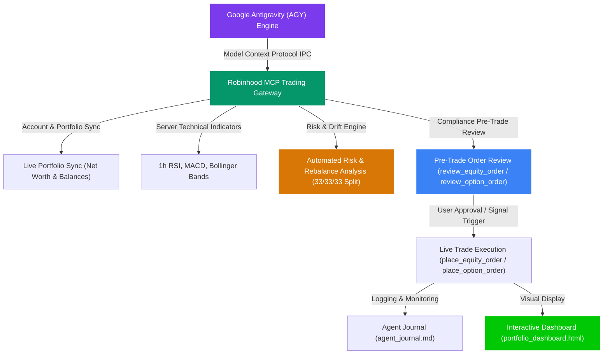

# 📈 Robinhood Agentic Trading Portfolio Manager


An institutional-grade, multi-asset autonomous AI portfolio management system built for **Google Antigravity (AGY)** and the **Robinhood MCP Trading Gateway**.

---

## 🚀 Tech-Forward Robinhood Innovations Leveraged

This system takes full advantage of Robinhood’s industry-leading fintech innovations:

1. 🌙 **24-Hour Market (24/5 Equities & ETF Trading)**: Executes extended hours limit orders (`market_hours="extended_hours"`) via Blue Ocean ATS from Sunday 8:00 PM EST to Friday 8:00 PM EST to capitalize on earnings reports and Asian market opens.
2. 🎯 **Event Contracts & Prediction Markets (via Kalshi)**: Uses binary $0.01 – $0.99 macro contracts (Fed interest rates, CPI inflation data) to hedge equity positions, tracked via `get_pnl_trade_history`.
3. 🛡️ **Agentic Sub-Accounts & Budget Sandboxing**: Operates safely inside a dedicated sub-account (`618678015`) with push notifications and budget sandboxing, keeping primary wealth 100% air-gapped.
4. 💵 **High-Yield Uninvested Cash Sweep**: Uninvested settled cash automatically earns top-tier APY interest in FDIC-insured partner banks while waiting for technical dip-buy signals.
5. ⚖️ **Automated Risk Exposure & Rebalancing Engine**: Continuously evaluates capital concentration across the 3 core asset buckets (Equities, Options, Crypto) against the target 33.3% benchmark, alerting on allocation drift >10% and calculating cash reserve ratios.

---

## 🏛️ System Architecture Diagram

Explore the complete step-by-step system walkthrough & detailed guide in [**`WALKTHROUGH.md`**](file:///c:/Users/danny/OneDrive/Desktop/my-first-project/WALKTHROUGH.md).



---

## 🌟 Executive Overview (Showcase Summary)

The **Robinhood Agentic Trading Portfolio Manager** is an autonomous AI investment system designed to demonstrate how cutting-edge LLM agents can safely interact with live financial brokerage APIs via the **Model Context Protocol (MCP)**.

Rather than making emotional human trades or relying on simple rule-based scripts, the system operates as an **algorithmic 4-bucket portfolio manager** — combining institutional technical indicators (RSI, MACD, Bollinger Bands), strict SEC/FINRA regulatory safeguards, and pre-trade simulation reviews to manage capital across **Equities**, **Options**, **Crypto**, and **Event Markets**.

---

## 💡 Beginner-Friendly Trading Strategies

For a full quantitative strategy breakdown, see [**`STRATEGY.md`**](file:///c:/Users/danny/OneDrive/Desktop/my-first-project/STRATEGY.md).

* 📊 **Equities Bucket (~$50.00) — Buying Quality Stocks "On Sale" & 24/5 Trading**: Uses 1-hour RSI, MACD, and Bollinger Bands to identify when strong stocks (`NVDA`, `SPY`, `QQQ`, `AAPL`) are dip-buying opportunities during regular and 24/5 extended hours (+4.0% Take Profit, -2.0% Stop Loss).
* 🎯 **Options Bucket ($50.00) — "Discount Coupons" with High Odds**: Single-leg **High-Delta In-The-Money Calls** (Delta 0.75 – 0.85+, **80%+ Win Probability**, $15 – $40 premium cap) controlling 100 shares for high-probability gains.
* 🪙 **Crypto Bucket ($50.00) — 24/7 Off-Hours Momentum & Dip-Buying**: Continuous 24/7 monitoring of `BTC-USD`, `ETH-USD`, `SOL-USD`, and `DOGE-USD` on the "Agentic Crypto" watchlist. Buys $10–$25 oversold dips (RSI < 38) and locks in **+5.0% to +8.0% profits** (-3.0% Stop Loss).
* 🎯 **Event Contracts & Cash Sweep Reserve**: Macro risk hedging via binary event contracts and automatic high-yield APY interest on uninvested settled cash.

---

## 💼 Resume & Portfolio Summary (For Recruiters & Executives)

> *"Engineered an autonomous AI multi-asset portfolio manager using Google Antigravity (AGY) and the Robinhood MCP Trading Gateway. Architected a 4-bucket quantitative allocation model (Equities, Level 2 Options, 24/7 Crypto, Event Contracts) leveraging 24/5 Blue Ocean ATS trading, high-yield cash sweeps, and FINRA Rule 4210 (PDT), SEC Reg T (GFV), and IRS Code § 1091 (Wash Sale) safeguards with zero PII exposure."*

---

## ⏰ Recommended Schedule Frequencies

For operational setup instructions, see [**`USAGE_GUIDE.md`**](file:///c:/Users/danny/OneDrive/Desktop/my-first-project/USAGE_GUIDE.md).

| Asset Class / Bucket | Recommended Schedule Frequency | Active Session Hours | Objective |
| :--- | :--- | :--- | :--- |
| **Equities & 24/5 ETFs** | **Hourly** (`0 * * * *`) | Mon–Fri 24/5 (Blue Ocean ATS Session) | Monitor RSI oversold setups & take-profit / stop-loss boundaries |
| **Level 2 Options** | **Hourly or Pre-Market** | Mon–Fri, 9:30 AM – 4:00 PM EST | Scan High-Delta ITM Calls & manage option expirations |
| **24/7 Crypto** | **Every 4 Hours** (`0 */4 * * *`) | 24 Hours / 7 Days a Week | Track Bitcoin, Ethereum, Solana, and Dogecoin momentum |

---

## 🛡️ Built-in Financial Regulatory Safeguards

This project enforces 4 mandatory financial regulatory protection rules directly inside the AI execution architecture:

1. **FINRA Rule 4210 (PDT Protection)**: Rolling 5-day day-trade tracking capping intraday roundtrips at a max of 2 day-trades per 5 days.
2. **SEC Regulation T (GFV Lock)**: Cash-account settlement tracking preventing Good Faith Violations.
3. **IRS Code § 1091 (Wash Sale Disallowance)**: 31-day wash-sale cooldown logging and buy-blocking on loss positions.
4. **Pre-Trade Compliance Preview**: Mandatory order simulations (`review_equity_order` & `review_option_order`) inspecting bid/ask spreads, regulatory fees ($0.04 total), and broker compliance alerts (`order_checks`) prior to live execution.

---

## 🖥️ Visual Dashboard & Diagnostic Testing

* 📊 **Interactive Visual Dashboard**: Open [**`portfolio_dashboard.html`**](file:///c:/Users/danny/OneDrive/Desktop/my-first-project/portfolio_dashboard.html) in your browser to view real-time capital allocation charts, P&L tables, and queued order audits.
* 🧪 **5-Second Connection Test**: Run `python test_connection.py` on any machine to verify Robinhood MCP gateway connectivity and agentic permissions instantly.
* 📝 **Chronological Agent Journal**: Open [**`agent_journal.md`**](file:///c:/Users/danny/OneDrive/Desktop/my-first-project/agent_journal.md) to review full timestamped records of every technical scan, simulation preview, and trade execution.

---

## 🚀 Quickstart (Launching via AGY)

### 1. Clone the Repository
```bash
git clone https://github.com/xylaes/robinhood-agentic-trading.git
cd robinhood-agentic-trading
```

### 2. Environment Setup
Create a `.env` file from the provided `.env.example` template:
```bash
cp .env.example .env
```
*(Optional: Add your `ROBINHOOD_ACCOUNT_NUMBER=your_account_id` in `.env`, or leave blank for automatic resolution via Robinhood MCP).*

### 3. Install Dependencies
```bash
python -m venv .venv
# Windows:
.venv\Scripts\activate
# macOS/Linux:
source .venv/bin/activate

pip install -r requirements.txt
```

### 4. Execute Diagnostic & Portfolio Run
```bash
python test_connection.py
python portfolio_manager.py
```

---

## 📂 Repository Structure

* 📂 **[`src/`](file:///c:/Users/danny/OneDrive/Desktop/my-first-project/src)**: Modular Python package (`config.py`, `ssot.py`, `macro_hedging.py`, `risk_manager.py`).
* 🎬 **[WALKTHROUGH.md](file:///c:/Users/danny/OneDrive/Desktop/my-first-project/WALKTHROUGH.md)**: System Architecture Diagram & step-by-step beginner guide.
* 🧠 **[STRATEGY.md](file:///c:/Users/danny/OneDrive/Desktop/my-first-project/STRATEGY.md)**: Detailed trading strategy rules for Equities, Options, Crypto, and Event Markets.
* 📖 **[USAGE_GUIDE.md](file:///c:/Users/danny/OneDrive/Desktop/my-first-project/USAGE_GUIDE.md)**: Non-technical showcase guide & schedule frequency rules.
* 📄 **[portfolio_manager.py](file:///c:/Users/danny/OneDrive/Desktop/my-first-project/portfolio_manager.py)**: Single, unified entry point orchestrator script.
* 📊 **[portfolio_dashboard.html](file:///c:/Users/danny/OneDrive/Desktop/my-first-project/portfolio_dashboard.html)**: Interactive visual dashboard.
* 🧪 **[test_connection.py](file:///c:/Users/danny/OneDrive/Desktop/my-first-project/test_connection.py)**: 5-second diagnostic connection test script.
* 📝 **[agent_journal.md](file:///c:/Users/danny/OneDrive/Desktop/my-first-project/agent_journal.md)**: Main chronological journal.
* 📋 **[.env.example](file:///c:/Users/danny/OneDrive/Desktop/my-first-project/.env.example)**: Environment variable template file.
* 📄 **[LICENSE](file:///c:/Users/danny/OneDrive/Desktop/my-first-project/LICENSE)**: Standard MIT Open Source License.
* 📦 **[requirements.txt](file:///c:/Users/danny/OneDrive/Desktop/my-first-project/requirements.txt)**: Minimal required Python dependencies.
* ⚙️ **[.gitignore](file:///c:/Users/danny/OneDrive/Desktop/my-first-project/.gitignore)**: Comprehensive ignore rules excluding temporary files and PII.

---

## ⚠️ Financial, Legal & Trademark Disclaimers (Use at Your Own Risk)

> **DISCLAIMER**: This repository, software, and documentation are provided strictly for **educational, personal project, portfolio showcase, and research purposes only**.
>
> * **Non-Affiliation & Trademark Disclaimer**: This project is an independent personal software project developed by individual user(s) and is **not affiliated, associated, authorized, endorsed by, or in any way officially connected with Robinhood Markets, Inc.**, **Google LLC**, or any of their subsidiaries or affiliates.
>   - Official Robinhood website: [https://robinhood.com](https://robinhood.com)
>   - Official Google website: [https://google.com](https://google.com)
>   - The names "Robinhood" and "Google" (including "Google Antigravity" / "AGY"), as well as related names, marks, emblems, and logos, are registered trademarks of their respective owners.
> * **No Financial Advice**: Nothing contained in this codebase, documentation, or generated reports constitutes financial, investment, legal, or tax advice.
> * **High-Risk Investment Warning**: All trading across equities, options, and cryptocurrencies involves significant risk of monetary loss. Extended-hours trading (24/5 Blue Ocean sessions) and cryptocurrency markets carry heightened volatility and liquidity risks.
> * **Provided "AS IS" Without Warranty**: As set forth in the MIT License, this software is provided "AS IS", without warranty of any kind, express or implied. The authors and contributors assume **zero responsibility or legal liability** for any financial losses, execution errors, broker outages, API failures, or damages resulting from the use or misuse of this software.
> * **User Responsibility**: Users are solely responsible for validating order parameters, conducting independent research, and complying with all applicable FINRA, SEC, and local financial regulations.
