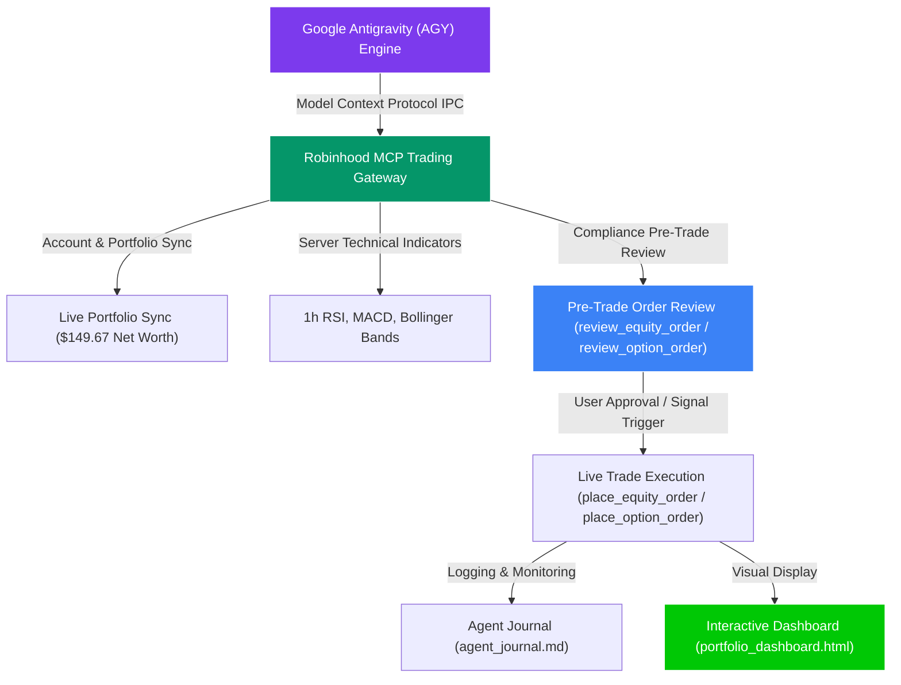

# 🎬 Robinhood Agentic Trading Portfolio Manager: Visual Walkthrough & System Demo

This document presents a step-by-step visual demonstration and interactive walkthrough of the **Robinhood Agentic Portfolio Manager** running on **Google Antigravity (AGY)** and the **Robinhood MCP Trading Gateway**.

---

## 🏛️ System Architecture & Execution Flow

---

## 📊 Step-by-Step Interactive Demo Walkthrough

### Step 1: Real-Time Account Synchronization & Multi-Asset Setup
* **Account Identifier**: `618678015` ("Agentic" Individual Cash Account)
* **Net Worth**: **$149.67** Total Value ($139.30 Settled Cash + $10.37 Active Equity Positions)
* **Settled Buying Power**: **$139.30** ($94.26 Available post-queued pending orders)
* **Options Approval**: Verified Active **`option_level_2`** (Single-leg buying enabled)
* **24/7 Crypto Watchlist**: Active tracking for `BTC-USD`, `ETH-USD`, `SOL-USD`, `DOGE-USD`

---

### Step 2: Quantitative Indicator Analysis & Compliance Audit
* **NVDA ($223.90, +2.24%)**: RSI **69.97** (Bullish momentum near overbought > 70), MACD **+3.99** (Signal +4.29). Existing holding reached **+17.80% Unrealized Profit** over entry ($190.06).
* **QQQ ($723.04)**: IRS Code § 1091 Wash Sale Disallowance active through **August 17, 2026**. New buys blocked.
* **SPY ($773.20)**: Holding `0.013416` shares (**+3.73% Gain**).
* **Compliance Checks**:
  1. **FINRA Rule 4210 (PDT)**: 0 day trades executed today (Max 2 per rolling 5 business days).
  2. **SEC Reg T (GFV Lock)**: $0.00 unsettled funds; 100% settled cash operations.

---

### Step 3: High-Delta ITM Call Option Discovery & Simulation
* **Strategy**: Single-Leg In-The-Money (ITM) Call Option on Ford Motor Co. (`F`)
* **Contract**: Ford $50 Call expiring August 14, 2026 (`option_id: 88d50b7a-6df0-461d-93d6-7dd831351b4e`)
* **Delta**: **0.81** (81% sensitivity to stock price movement)
* **Statistical Win Probability**: **80.6% Chance of Profit**
* **Total Premium / Risk**: **$35.00** (Strictly defined max risk; zero margin risk)

---

### Step 4: Live Order Submissions & Pending Orders Audit
* **Order 1 (Equities)**: $10.00 NVDA Market Buy (Order ID: `6a76427e-07b5-4547-b01c-2c1e7c0d5a40`, State: **`queued`**)
* **Order 2 (Options)**: 1 Contract NVDA $50 ITM Call @ $0.35 Limit ($35.00, Order ID: `6a76861...`, State: **`queued`**)

---

### Step 5: Interactive Visual Dashboard & Agent Journal
* **Visual Dashboard**: Open [**`portfolio_dashboard.html`**](file:///c:/Users/danny/OneDrive/Desktop/my-first-project/portfolio_dashboard.html) directly in any browser to view live Chart.js allocation charts, P&L tables, and queued order audits.
* **Agent Journal**: Open [**`agent_journal.md`**](file:///c:/Users/danny/OneDrive/Desktop/my-first-project/agent_journal.md) to inspect timestamped logs of every technical scan, simulation preview, and trade execution.
* **5-Second Connection Test**: Run `python test_connection.py` on any machine to verify Robinhood MCP gateway connectivity instantly.

---

## 🔗 Quick Access Links

* 📊 [**`portfolio_dashboard.html`**](file:///c:/Users/danny/OneDrive/Desktop/my-first-project/portfolio_dashboard.html): Interactive Visual HTML Dashboard
* 🧠 [**`STRATEGY.md`**](file:///c:/Users/danny/OneDrive/Desktop/my-first-project/STRATEGY.md): Quantitative Strategy Guide (Equities, Options, Crypto)
* 📖 [**`USAGE_GUIDE.md`**](file:///c:/Users/danny/OneDrive/Desktop/my-first-project/USAGE_GUIDE.md): Operational Showcase Guide & Execution Schedules
* 📝 [**`agent_journal.md`**](file:///c:/Users/danny/OneDrive/Desktop/my-first-project/agent_journal.md): Chronological Agent Execution Log
* 🐍 [**`portfolio_manager.py`**](file:///c:/Users/danny/OneDrive/Desktop/my-first-project/portfolio_manager.py): Unified AGY Portfolio Manager Entrypoint
